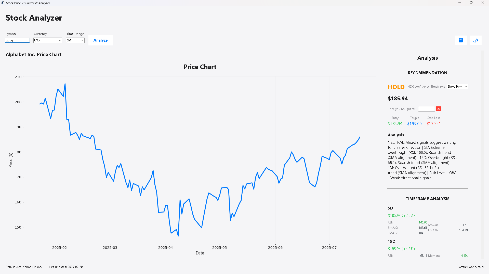

# Stock Price Visualizer & Analyzer


---

<div align="center">
  
  <br/>
  <b>Stock Price Visualizer & Analyzer</b>
  <br/>
  <i>Modern, Apple-inspired, cross-currency stock analytics for everyone.</i>
</div>

---

## ✨ Overview

**Stock Price Visualizer & Analyzer** is a sleek, modern Python desktop app for visualizing and analyzing global stock data. Inspired by Apple's design language, it features a clean, intuitive interface, beautiful charts, and seamless currency conversion for a truly international experience.

- 📈 **Visualize** historical stock prices with interactive, modern charts
- 🌍 **Analyze** stocks from US, India, UK, Japan, and more
- 💱 **Convert** prices between USD, INR, EUR, GBP, JPY with real-time rates
- 🧮 **Professional statistics** and actionable recommendations
- 🧊 **Automatic cache management** for fast, fresh data

---

## 🚀 Features

- **Apple-like Modern UI:** Clean, minimalist, and responsive interface
- **Multi-currency Support:** Instantly convert all prices to your preferred currency
- **Accurate Global Data:** Fetches from Yahoo Finance, supports major world exchanges
- **Advanced Analysis:** Moving averages, RSI, volatility, drawdown, and more
- **Smart Recommendations:** Buy/Hold/Sell signals with confidence levels
- **Interactive Charts:** Line and candlestick modes, hover tooltips, dark/light themes
- **Automatic Cache Clearing:** Cache is wiped every time you close the app

---

## 🖥️ Installation

1. **Clone the repository:**
   ```bash
   git clone https://github.com/yourusername/stockanalyzer
   cd stockanalyzer
   ```
2. **Install dependencies:**
   ```bash
   pip install -r requirements.txt
   ```

---

## 💡 Usage

Simply run:
```bash
python run_app.py
```

- Enter a stock symbol (e.g., `AAPL`, `TATAMOTORS`)
- Select your preferred currency (USD, INR, EUR, GBP, JPY)
- Choose a time range and analyze
- Enjoy beautiful, interactive charts and professional-grade analytics

---

## 🌐 Currency Conversion
- All prices are shown in USD by default, regardless of the stock's native currency
- When you switch currency, all prices are converted in real-time using the latest rates
- Foreign stocks (e.g., Tata Motors) are always converted to USD first, then to your selected currency

---

## 🧊 Cache Behavior
- Data is cached for fast access during your session
- **Cache is automatically cleared every time you close the app**—no stale data, always fresh

---

## 📸 Screenshots

> _Add your own screenshots to `docs/screenshot.png` to showcase the beautiful UI!_

---

## 📦 Dependencies
- Python 3.7+
- yfinance
- pandas
- matplotlib
- numpy
- tkinter (standard with Python)

---

## 📝 License
[MIT](LICENSE)

---

<div align="center">
  <i>Designed with a modern, Apple-inspired aesthetic for the best user experience.</i>
</div>


